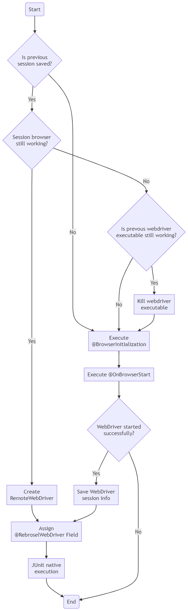

# Rebrosel #

### REuse BROwser with SELenium ###

Rebrosel allows executing Selenium automation tests in the same browser session even after tests are done. It was 
created for use in debugging, working with the production environment, and to make simple iterative development of 
automation code on the same page without running the whole test. It is a small (~19 Kb) library written in pure Java, 
having only JUnit and Selenium as dependencies, so it can be used in scratches as well as in existing frameworks. The 
author considers it mostly like a debug tool and simple code checking in prod environment when it is hard to run the 
whole script due to captcha, two-factor authorization, or other reasons.

Main implementation is based on TARUN LALWANI's (https://github.com/tarunlalwani) post 
https://tarunlalwani.com/post/reusing-existing-browser-session-selenium-java/ 

### Getting started ###
First of all, the Rebrosel jar should be set as a dependency of the current project. It can be done either in IDE 
project settings or in a build tool. For example, for Gradle, the following lines should be added in the `build.gradle` 
file:
```Groovy
repositories {
    flatDir {
        dirs '{PATH_TO_DIR_WITH_REBROSEL.JAR_FILE}'
    }
}

dependencies {
    implementation name: 'rebrosel:rebrosel'
}
```

To get started with the Rebrosel, 3 mandatory things should be done:
1. Test class must be annotated with `@RunWith(RebroselRunner.class)`
2. The only method with `@BrowserInitialization` annotation, having `public static` modifiers and return WebDriver 
   class variable should be created. 
3. Test class should have the only field of WebDriver class with `@RebroselWebDriver` annotation and `static` modifier.

The method with `@OnBrowserStart` annotation is optional, but still must be the only one and have `public static` 
modifiers and be `void`.

Of course, at least one `@Test` annotated method (so it can be empty) is needed to start JUnit execution.

If there are any issues, Rebrosel will put errors in a console.

Inheritance is supported. Though still the only method with `@BrowserInitialization`, one with `@OnBrowserStart` and 
one field with `@RebroselWebDriver` annotations are allowed across the inherited classes.

Simple example:
```Java
@RunWith(core.runner.RebroselRunner.class)
public class Test {

    @RebroselWebDriver
    static WebDriver driver;
    
    @BrowserInitialization
    public static WebDriver browserInit() {
        System.setProperty("webdriver.chrome.driver", {PATH_TO_CHROME_DRIVER});
        return new ChromeDriver();
    }

    @Test
    public void openBrowser() {
    }
}
```
You can run the `openBrowser()` method, the browser will be opened, then you do whatever you want to get to a certain 
page and just start another test. The test will be started on that page. The main thing - to not close the browser, 
otherwise it will be initiated again.

### Execution flow ###
The framework just extends the JUnit execution by adding 2 method annotations: `@BrowserInitialization` and 
`@OnBrowserStart`. Both are executed before `@BeforeClass` annotated method in a test. After a webdriver is 
initialized either by connecting to a previous session or initializing a new one, the native JUnit execution is 
started. The only difference - if there's an issue during initialization (in methods annotated with 
`@BrowserInitialization` or `@OnBrowserStart`), method with `@AfterClass` annotation will not be executed.

`@BrowserInitialization` annotation is used to initiate a new WebDriver instance, and the method annotated with it 
must return WebDriverClass. The method with `@OnBrowserStart` annotation is not mandatory to have, but if it is in the 
code, it will be executed right away after one with `@BrowserInitialization` annotation.

If both methods were run without exceptions, the browser session information will be saved to a temporary file and be 
used later to try to connect to this existing session:



### Prehistory ###

One of the author's friends was given homework for an interview to write a web automation code for the Salesforce 
application in prod. Salesforce is a pretty challenging web application to automate. There are custom tags that 
sometimes break locator identification and two-factor authorization. Besides, the application blocks a user from 
logging in after several times in a certain period of time. It means that a tester has few attempts to check the 
automation code if the browser session is over (what actually happens once the Selenium test is done, even if the 
webdriver was not killed).

After that, there was an idea to make the connection of tests to the same browser session in a simple, user-friendly 
way. Unfortunately, it was not that simple. All webdrivers have their own nuances while reconnecting to existing 
browsers, and webdriver executables remain running if the driver is not explicitly killed. For some actions, OS 
commands are used with creating CLI processes. So it makes this framework highly dependable on browsers and OSs. As of 
version 0.1a, it is supposed to work only on Windows and macOS. See tested configurations in "Known issues".

### Known issues ###
Rebrosel has been tested on: 
 - Windows 10 x64 1903, browsers:
   - Chrome 90.0.4430.93 (ChromeDriver 90.0.4430.24),
   - FireFox 88.0 (GeckoDriver 0.29.1),
   - Edge 90.0.818.51 (EdgeDriver 90.0.818.51),
   - Opera 76.0.4017.94 (OperaDriver 90.0.4430.85);
 - macOS 10.14.6, browsers:
   - Chrome 90.0.4430.93 (ChromeDriver 90.0.4430.24),
   - FireFox 88.0 (GeckoDriver 0.29.1),
   - Edge 90.0.818.51 (EdgeDriver 90.0.818.51),
   - Opera 76.0.1 (OperaDriver 90.0.4430.85),
   - Safari 14.1.
  
Known issues:    
- Opera browser should be fully killed to make framework restart the browser (issue mostly confusing on Mac). 
  Operadriver does not throw any exceptions if the browser is not ready for some reason. So the framework checks the 
  working browser in running processes.
- If another type of browser is initialized in `@BrowserInitialization` and the previous one is still running, the 
  framework most likely will not complain and will try to run tests on the wrong browser. For example, the previous 
  test used Chrome, Chrome is still running, and the new test initializes Edge, the framework will connect to existing 
  Chrome. Currently, there is no way to check what browser is running in RemoteWebDriver if it is connected with 
  SessionId and Url.
- If there is an issue with the initialization of WebDriver, the webdriver executable will be running, and the used 
  port will be blocked. There is no way to figure out what port is used: WebDriver instance is not initialized due to 
  Exception, and we cannot get port from it; webdriver executable writes to a process console so get it even from 
  there is not possible. Well, probably there are still some ways, but complexity is not worth it. Frankly, this 
  behavior is the same for any framework using Selenium WebDriver.
  


                                        